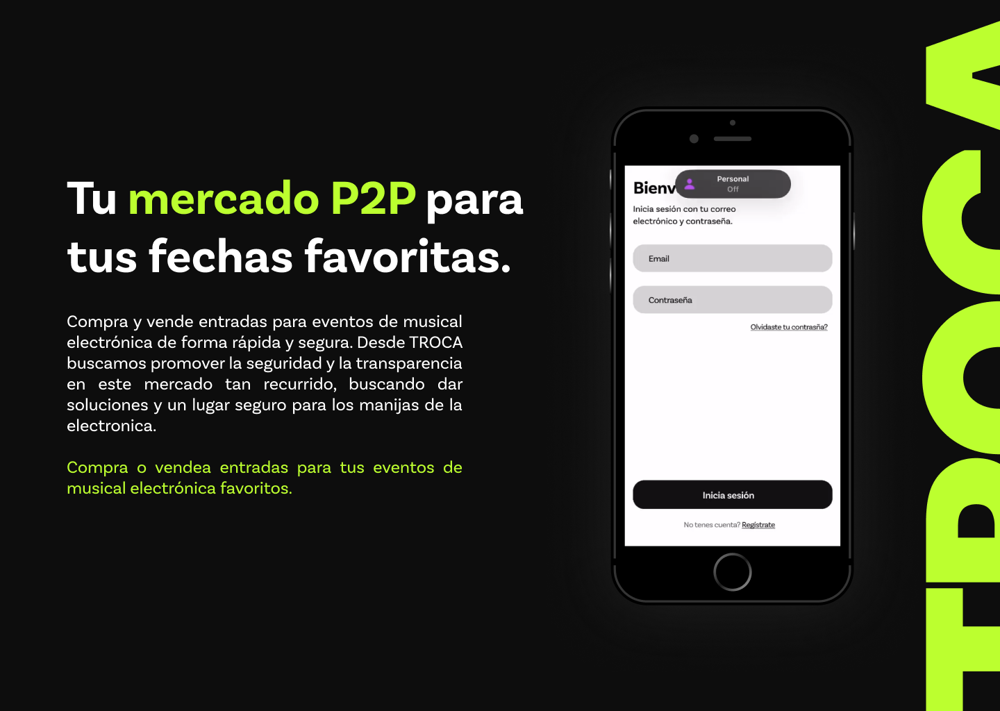

## Overview


>TROCA
: is a digital ticketing platform that operates through a website. We serve as an intermediary between buyers and resellers of electronic music event tickets. Our platform provides users with a secure, straightforward, and efficient environment to explore a variety of ticket options and prices.

## Features
- **Secure Environment:** We prioritize user safety while ensuring that all active tickets and transactions are conducted securely.
- **Simplicity:** Our user-friendly interface makes it easy for users to navigate and find the tickets they need.
- **Variety:** Explore a wide range of ticket options for electronic music events.
- **Competitive Pricing:** Compare prices and choose the best deal for your favorite events.

Join us today and experience the convenience of TROCA! 🎵🎟️

## Members

- Backend
  - [Matias Aaron](https://www.linkedin.com/in/matias-sosa-a03560242/)
  - [Nestor Frias](https://www.linkedin.com/in/nesarifr/)
- Full Stack
  - [Agustin Lorca](https://www.linkedin.com/in/agustin-lorca/)
- QA Tester
  - [Adriana Brizuela](https://www.linkedin.com/in/adriana-brizuela)
  - [Ivan Rojas](https://www.linkedin.com/in/ivanrojasorg/)
- UX/UI
  - [Santiago Vergara](https://www.linkedin.com/in/santiago-vergara-87b4b9233/)


## Dev Database

- Create a database in your local machine
- Use the following credentials to connect to the database
  - Database Name: trocaDataBase
  - Username: postgres
  - Password: root
  - Host: localhost
  - Port: 3008
- Run the following command to create a docker image
  ```bash
  docker run --name trocaDataBase -e POSTGRES_PASSWORD=root -e POSTGRES_USER=postgres -e POSTGRES_DB=trocaDataBase -p 3008:5432 -d postgres
  ```
  
## Dev Server

- Run maven install to build the project
- Run the following command to start the server
  - `mvn spring-boot:run`
  - The server will start on port 8080
  - The server will start on the following URL: https://troca-prod.onrender.com/

## Swagger

- The swagger documentation can be accessed at the following URL
  - https://troca-prod.onrender.com/swagger-ui

## PROD Server
- Run maven install to build the project
- Run the following command to start the server
  - `mvn spring-boot:run`

```properties
spring_profiles_active = **   
PROD_DB_HOST= **
PROD_DB_PORT= **
PROD_DB_NAME= **
PROD_DB_USERNAME= **
PROD_DB_PASSWORD= **
```

## Screenshots
 

For more information, visit our official website or check out our GitHub repository. You can also catch us on the Disc Golf Network. 🚀🎉

